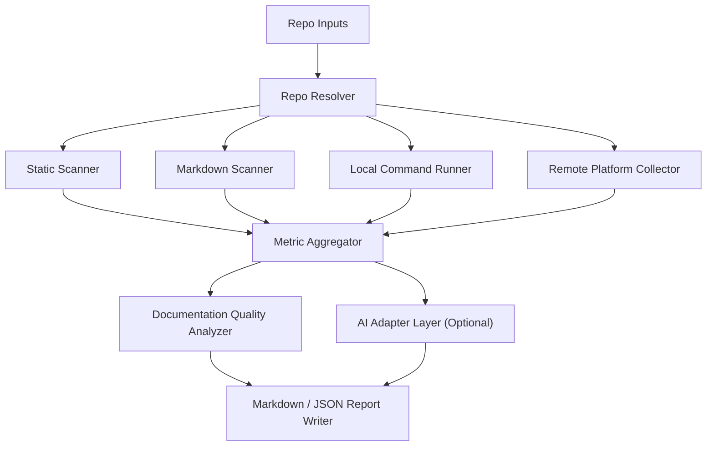

# Repo Dev Eval Agent Architecture

## 1. 目标

构建一个面向开源社区代码仓的软件开发体验评估 Agent，输入是一组仓库
URL、本地路径或 `owner/repo` 标识，输出是可落地的 Markdown / JSON 报告。

报告聚焦三类问题：

1. 本地编码体验
2. 本地构建、UT、代码检测可运行性
3. PR 流水线效率、资源和 AI 代码检视能力

与第一版相比，这一版额外强调：

- 扫描整个仓库的 Markdown，而不仅是 `README.md`
- 按根因分类 Markdown 不准确问题
- 支持 GitHub 与 GitCode 两类远端平台
- 支持可配置 AI CLI 适配器，而不是把 Codex 写死
- 提供一键式命令行入口

## 2. 输入 / 输出契约

### 输入

- 仓库列表
  - GitHub URL
  - GitCode URL
  - `owner/repo`
  - 本地路径
- 可选全局策略
  - PR 时间窗口，例如最近 30 天
  - 是否执行本地构建 / 测试 / 代码检测
  - 本地命令执行器，例如 `host` / `wsl`
  - AI adapter 配置
  - GitHub / GitCode token 环境变量名

### 输出

每个仓库输出以下信息：

#### 本地编码

1. 编码风格是否有定义
2. 代码检查是否支持

#### 本地构建与 UT

1. 本地增量构建时间
2. 本地 UT 执行时间
3. 本地代码检测执行时间

#### PR 流水线

1. 代码检查规则数量
2. 是否具备自动修复能力
3. 是否支持 AI 辅助代码检视
4. 指定时间窗口内的 PR 流水线平均时长
5. 单次 PR 资源 CPU / NPU 消耗量

#### Markdown 文档质量

1. 扫描了多少 Markdown 文件
2. 提取出哪些安装 / 构建 / 测试 / 代码检测 / 容器命令
3. 文档问题属于 Markdown 缺失、环境阻塞还是仓库脚本问题
4. 每类问题对应的改进建议

## 3. 设计原则

### 3.1 先确定性采集，再用 AI 总结

先用确定性信号采集：

- 仓库文件
- Markdown 命令块
- CI / workflow 配置
- GitHub / GitCode API
- 本地命令执行结果

AI 适配器只负责：

- 总结强弱项
- 给出高层改进建议
- 解释边界情况

### 3.2 平台适配与优雅降级

- GitHub：工作流时长、PR review、issue comment、runner labels
- GitCode：PR comment / review bot 信号
- 无 token 时明确降级，不伪造结论

### 3.3 证据优先

每个结论都尽量给出证据：

- 命中的文件路径
- 提取出的 Markdown 命令
- 实际执行的命令
- API 采样窗口
- 失败摘要

## 4. 高层架构



## 5. 核心模块

### 5.1 Repo Resolver

职责：

- 归一化 URL / 路径 / `owner/repo`
- 根据输入决定是否复用本地仓
- 解析远端平台类型

关键点：

- 本地路径优先复用已有 `origin`
- GitHub / GitCode URL 都支持
- 一键 CLI 无需手写 YAML 配置

### 5.2 Static Scanner

职责：

- 识别编码风格定义
- 识别代码检查工具
- 估算规则数量
- 识别自动修复能力
- 识别 AI review workflow 信号
- 推断 build / test / check 命令
- 识别 Docker / compose / devcontainer 定义

### 5.3 Markdown Scanner

职责：

- 扫描整个仓库的 `*.md` / `*.mdx`
- 提取 fenced code block 中的 shell / bash / console 命令
- 对命令分类：
  - `install`
  - `build`
  - `test`
  - `check`
  - `container`

优先级规则：

- `docs/contributing/*`
- `docs/getting_started/*`
- 根目录 `README.md` / `CONTRIBUTING.md`
- 其他 `docs/*`
- 再到 `examples/*`、`benchmarks/*`

### 5.4 Local Command Runner

职责：

- 执行增量构建
- 执行 UT
- 执行代码检测
- 记录耗时、退出码、失败摘要

策略：

- 显式配置优先
- 否则用静态扫描推断的命令
- 本地命令执行可以统一开关
- 支持 `host` 与 `wsl` 两类 runner
- Windows 下会把 `FOO=bar cmd` 这类 Unix 风格前缀转换成 PowerShell 可执行形式

### 5.5 Remote Platform Collector

#### GitHub

采集：

- 指定窗口内的 workflow run
- job labels 与 runner 资源估算
- PR reviews
- PR issue comments

输出：

- 平均 / 中位 / 最近一次 PR 流水线时长
- CPU / NPU 估算
- AI review 机器人信号

#### GitCode

采集：

- 指定窗口内的 PR 列表
- PR comments

AI review 规则：

- 评论作者命中显式 marker，如 `ascend-robot`
- 或作者名带 `robot` / `bot`，且评论内容像 review 建议

限制：

- GitCode 评论采集依赖 `private-token`
- 没有 token 时只输出降级说明

### 5.6 Documentation Quality Analyzer

职责：

- 识别文档问题并做根因分类

当前分类：

1. `missing_build_command_docs`
2. `missing_test_command_docs`
3. `missing_code_check_docs`
4. `container_docs_not_self_contained`
5. `external_manual_dependency`
6. `missing_version_prerequisite`
7. `missing_dependency_step`
8. `missing_tooling_prerequisite`
9. `environment_network_blocker`
10. `repository_script_issue`

根因标签：

- `documentation`
- `environment`
- `repository`
- `mixed`

### 5.7 AI Adapter Layer

目标：

- 提供可配置 CLI adapter
- 不把实现写死在 Codex

接口字段：

- `provider`
- `command`
- `command_template`
- `model`

内置默认模板：

- `codex` / `openai-codex`
- `opencode`

其他 CLI：

- `trae`
- `claudecode`
- 自定义内部 CLI

做法：

- 通过 `command_template` 显式适配
- 无默认模板时明确报 `unsupported_provider`

## 6. 一键命令行

新增：

```powershell
python -m oss_issue_fixer.cli assess-repos `
  --repo https://github.com/vllm-project/vllm `
  --repo https://gitcode.com/Ascend/MindIE-SD `
  --pr-window-days 30 `
  --enable-local-commands `
  --report-root reports/eval
```

特点：

- 直接吃仓库输入
- 自动生成评估策略
- 自动输出 Markdown + JSON 报告
- 可选启用 AI 总结

## 7. 结果解释原则

对于“跑不通”的结论，必须尽量落到以下三类之一：

1. Markdown 不准确或不完整
2. 环境本身不满足前置条件
3. 仓库脚本 / 依赖 / 内容本身存在问题

不要把所有失败都简单归因给文档。

## 8. 参考实现要点

- GitHub Actions 时长按指定窗口过滤，不只看最新几次
- GitCode AI review 检测优先看 PR comment 作者与评论正文
- Markdown 问题报告必须给出改进建议，而不是只给失败现象
- AI summary adapter 必须允许替换 CLI，不依赖单一供应商

## 9. 后续扩展

- 文档命令的隔离执行沙箱
- Docker build / pull 的可选烟测模式
- GitCode 流水线时长采集
- self-hosted telemetry 对接，获得真实 CPU / NPU 指标
- 面向社区模板的“标准改进建议”库
